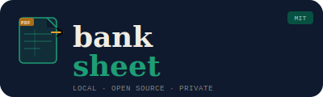

<p align="center">
  
</p>

<p align="center">
  Parse bank and credit card statement PDFs into CSV, Excel, or JSON. 100% local, no AI, no cloud.
</p>

<p align="center">
  <a href="https://github.com/tio-ze-rj/banksheet/actions/workflows/ci.yml"></a>
  <a href="https://nodejs.org/"></a>
  <a href="LICENSE"></a>
  <a href="https://github.com/tio-ze-rj/banksheet"></a>
</p>

## Features

- **Local-only** — your financial data never leaves your machine
- **No AI, no external APIs** — pure regex/text parsing
- **Multiple export formats** — CSV, Excel (.xlsx), JSON
- **Password-protected PDFs** — supports encrypted statements
- **Community-driven plugin system** — add any bank, any country

## Supported Banks

| Country | Bank | Statement Type | Tested with real PDF |
|---------|------|---------------|:--------------------:|
| BR | Bradesco | Credit card | Yes |
| BR | C6 Bank | Credit card | Yes |
| BR | Inter | Credit card | Yes |
| BR | Itaú | Credit card | Yes |
| BR | Nubank | Credit card | Yes |
| BR | Porto Seguro | Credit card | Yes |
| CA | PC Financial Mastercard | Credit card | Yes |
| US | Chase | Credit card | No |

Currently covers credit card statements only. More statement types (checking, savings) are welcome — see [Adding a Plugin](#adding-a-plugin).

## Quick Start

**Prerequisites:** Node.js 18+ and npm.

```bash
git clone https://github.com/tio-ze-rj/banksheet.git
cd banksheet
npm install
npm run build
```

## CLI Usage

```bash
# Parse a statement to CSV (default)
npx banksheet parse statement.pdf

# Parse multiple files
npx banksheet parse statement1.pdf statement2.pdf

# Output as Excel
npx banksheet parse statement.pdf -f excel -o output.xlsx

# Output as JSON
npx banksheet parse statement.pdf -f json

# Force a specific bank parser
npx banksheet parse statement.pdf -b "Itaú Cartão"

# Password-protected PDF
npx banksheet parse statement.pdf -p mypassword

# List available parsers
npx banksheet list
```

### CLI Options

| Flag | Description |
|------|-------------|
| `-f, --format <format>` | Output format: `csv`, `json`, `excel` (default: `csv`) |
| `-o, --output <path>` | Output file path |
| `-b, --bank <name>` | Bank name (skip auto-detection) |
| `-p, --password <password>` | PDF password for protected files |

## Web UI

```bash
npm run dev -w packages/web
```

Open [http://localhost:3000](http://localhost:3000). Upload a PDF, pick your format, and download the result. Set the `PORT` environment variable to use a different port.

## Adding a Plugin

banksheet supports any bank from any country. A plugin is a single folder that implements the `BankParser` interface.

### 1. Create the plugin directory

```
packages/core/src/plugins/{CC}/{bank-name}/
```

`{CC}` is the [ISO 3166-1 alpha-2](https://en.wikipedia.org/wiki/ISO_3166-1_alpha-2) country code (e.g. `BR`, `US`, `GB`).

### 2. Implement the parser

Create `index.ts` with a `BankParser`:

```typescript
import type { BankParser, Transaction } from '../../../types.js';

export const myBankParser: BankParser = {
  name: 'My Bank',
  country: 'US', // ISO 3166-1 alpha-2

  detect(text: string): boolean {
    // Return true if this PDF belongs to your bank.
    // Match on unique strings that appear in the extracted text.
    return /My Bank Statement/i.test(text);
  },

  parse(text: string): Transaction[] {
    const transactions: Transaction[] = [];
    // Extract transactions from the PDF text.
    // Each transaction needs:
    //   date:        ISO 8601 (YYYY-MM-DD)
    //   description: string
    //   amount:      number (negative = expense, positive = income)
    //   currency:    ISO 4217 (USD, BRL, EUR)
    //   type:        'credit' | 'debit'
    return transactions;
  },
};
```

### 3. Register the plugin

Add your parser to `packages/core/src/plugins/index.ts`:

```typescript
import { myBankParser } from './{CC}/{bank-name}/index.js';

// Add to the parsers array
const parsers: BankParser[] = [
  // ...existing parsers
  myBankParser,
];
```

### 4. Add tests

Create `__tests__/parser.test.ts` in your plugin folder. Use a real PDF fixture and verify that transactions are parsed correctly.

### 5. Add a plugin README

Create a `README.md` in your plugin folder documenting:

- Detection markers (strings that identify the bank in extracted text)
- PDF extraction quirks (glued text, missing spaces, etc.)
- Transaction format and edge cases

### Tips

- Each country has shared utilities: `plugins/BR/utils.ts` (`parseBRAmount`, `PT_MONTHS`), `plugins/CA/utils.ts` (`parseCADAmount`, `EN_MONTHS`).
- Use `pdf-parse` or `pdfjs-dist` to inspect the raw extracted text — it often looks very different from the visual PDF.
- Negative amounts = expenses, positive = income.

## Project Structure

```
banksheet/
├── packages/
│   ├── core/                   # Parsing engine and plugins
│   │   └── src/
│   │       ├── parser.ts       # PDF text extraction
│   │       ├── exporter.ts     # CSV/Excel/JSON export
│   │       ├── types.ts        # BankParser, Transaction interfaces
│   │       └── plugins/
│   │           ├── index.ts    # Plugin registry
│   │           ├── BR/         # Brazilian bank plugins
│   │           │   ├── utils.ts
│   │           │   ├── bradesco-cartao/
│   │           │   ├── c6-cartao/
│   │           │   ├── inter-cartao/
│   │           │   ├── itau-cartao/
│   │           │   ├── nubank-cartao/
│   │           │   └── porto-seguro-cartao/
│   │           ├── CA/         # Canadian bank plugins
│   │           │   ├── utils.ts
│   │           │   └── pc-financial-mastercard/
│   │           └── US/         # American bank plugins
│   │               ├── utils.ts
│   │               └── chase-credit/
│   ├── cli/                    # Command-line interface
│   └── web/                    # Web UI (Express + vanilla JS)
├── package.json
└── tsconfig.json
```

## Running Tests

```bash
# All packages
npm test

# Core only
npm test -w packages/core

# CLI only
npm test -w packages/cli

# Web only
npm test -w packages/web

# With coverage
npm run test:coverage
```

## License

[MIT](LICENSE)
